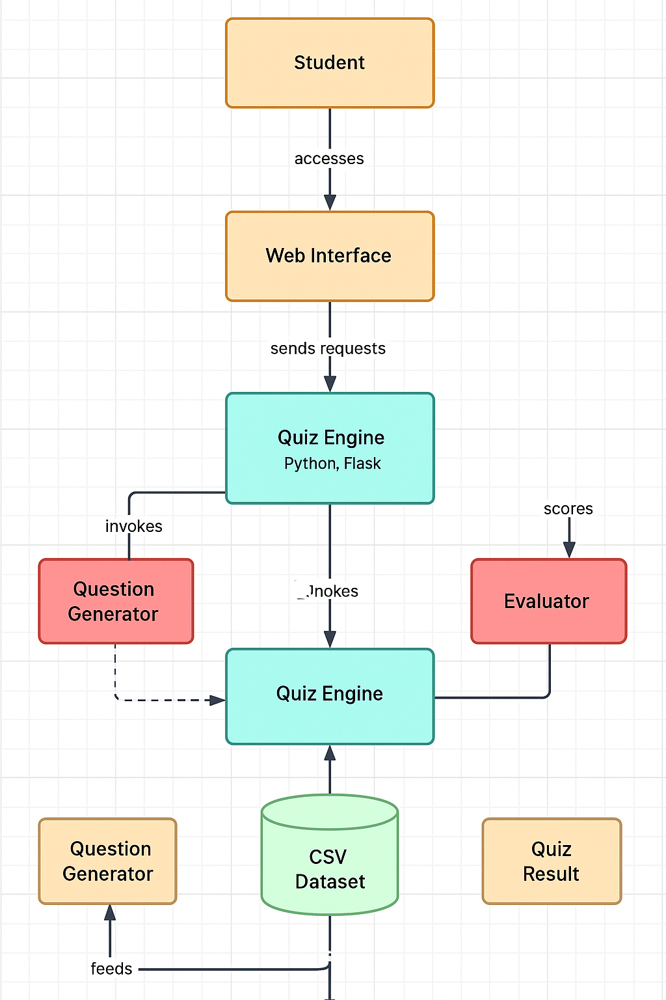

# 🧠 K12 Quiz Engine – Syllabus Reviser for Students

This project is a **Flask-based quiz application** that generates questions dynamically from a CSV database. Designed as a **syllabus revision tool** for K12 students, the app provides interactive subject-wise quizzes and evaluates student performance to help them identify gaps in understanding.

---

## 🚀 Features

- ✅ Dynamic question loading from CSV
- ✅ Subject-agnostic design (Science, English, Hindi, History, etc.)
- ✅ Score tracking and performance summary
- ✅ Session-based username tracking
- ✅ Clean and intuitive HTML templates (Welcome, Quiz, Result)
- ✅ Ready for deployment on Render

---

## 🏗️ Architecture Overview

 <!-- Replace with actual file name or hosted link -->

### High-Level Design:
- **Frontend:** HTML (Jinja2 templated), served via Flask
- **Backend:** Flask app with custom `quiz_engine.py` for logic
- **Data Layer:** CSV-based dataset (can be upgraded to DB)
- **Session Handling:** Flask session to track users and scores

---

## 🗂️ Project Structure

```bash
.
├── app.py                     # Main Flask app
├── quiz_engine.py            # Quiz logic: question load, answer check
├── generated_30_questions.csv # CSV file with quiz questions
├── templates/
│   ├── welcome.html
│   ├── quiz.html
│   └── result.html
├── requirement.txt           # Required Python packages
└── architecture.png          # (Optional) Architecture diagram

---

## 📦 Installation & Setup

1. Clone the repository

git clone https://github.com/Satyabrat2005/Quiz-engine-K12
cd k12-quiz-engine

2. Install Dependencies 

pip install -r requirement.txt

3. Run the app

python app.py


---

Let me know:
- If you have a **link or file for the architecture diagram** so I can format that section for you.
- If you want help making a nice banner or badge section for the top.


